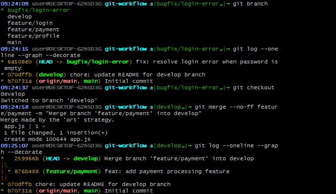
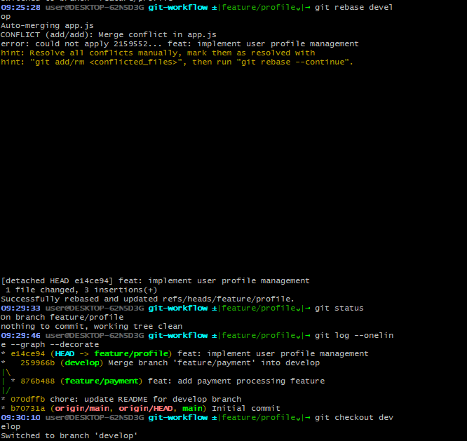
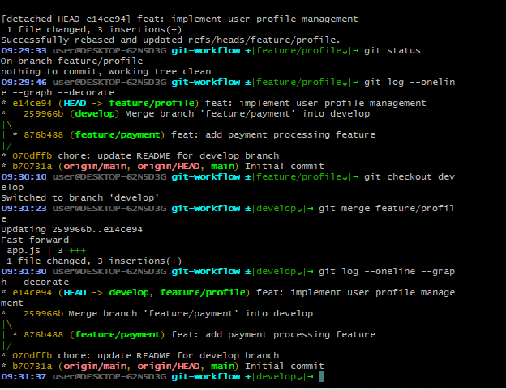
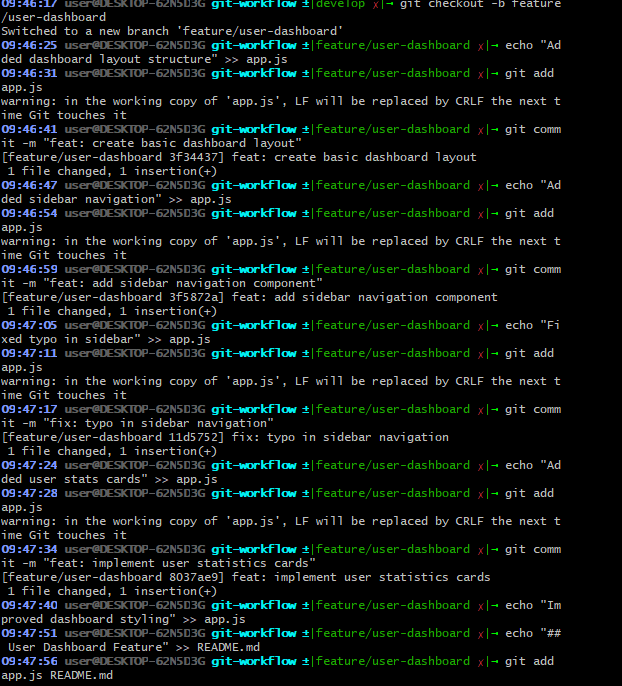
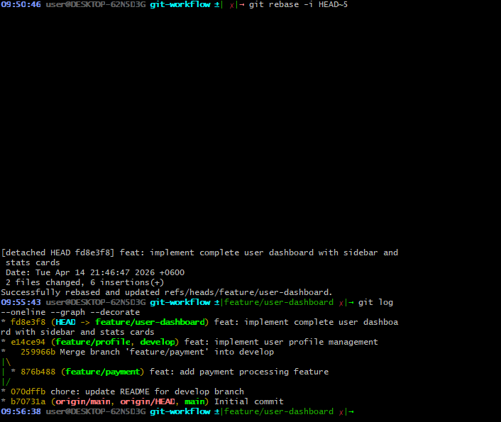
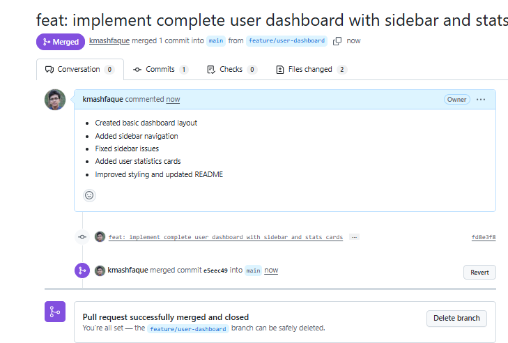
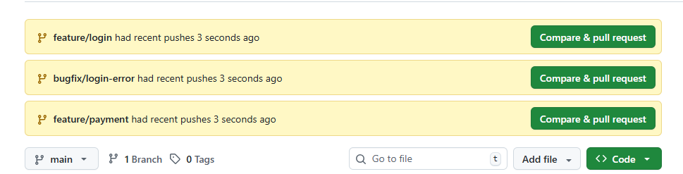
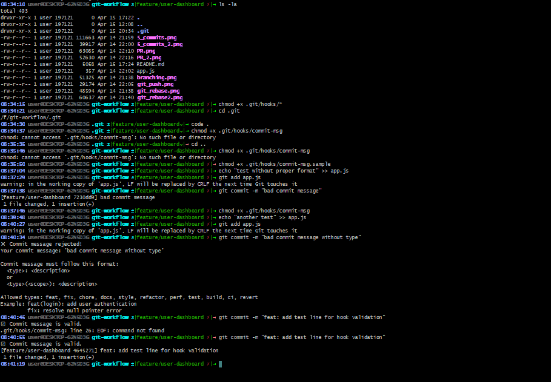
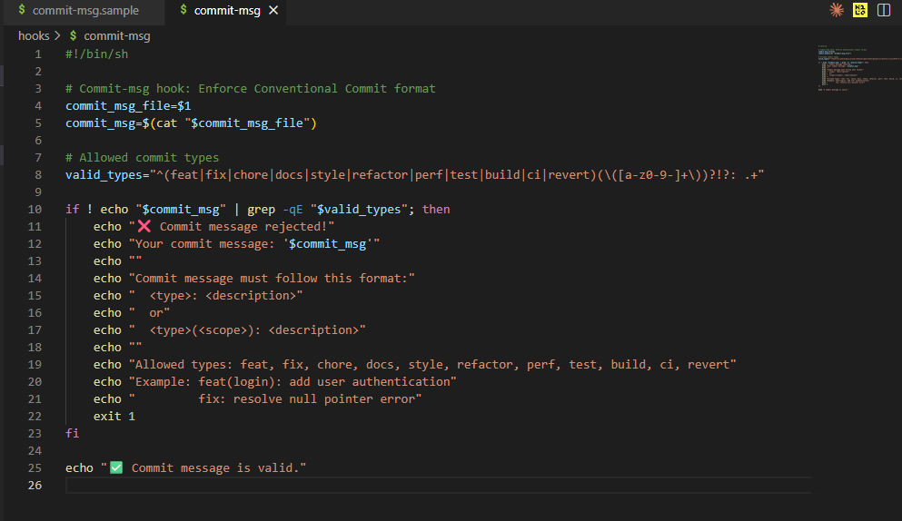

# Git Workflow Demonstration

This repository demonstrates a complete Git branching workflow including branch creation, merging, rebasing, interactive rebase, and remote synchronization.

## Overview

- **Task 1**: Repository Initialization
- **Task 2**: Branching Workflow
- **Task 3**: Commit History Management (Interactive Rebase)
- **Task Optional**: Final Cleanup & Remote Push

---

## Task 1: Repository Initialization

Create and initialize repository with initial commit on main branch.

```bash
mkdir my-awesome-app
cd my-awesome-app
git init

echo "# My Awesome App" > README.md
echo "console.log('Hello from main branch');" > app.js
mkdir src && echo "/* styles */" > src/styles.css

git add .
git commit -m "Initial commit: setup project structure"
```

Create develop branch:

```bash
git checkout -b develop
echo "Development branch active" >> README.md
git add README.md
git commit -m "chore: update README for develop branch"
```

Create feature/login branch:

```bash
git checkout -b feature/login develop
echo "function loginUser() { console.log('User logged in'); }" >> app.js
git add app.js
git commit -m "feat: implement basic login functionality"
```



---

## Task 2: Branching Workflow

Create additional feature branches:

```bash
git checkout develop
git checkout -b feature/payment
echo "function processPayment(amount) { console.log('Payment of $' + amount + ' processed'); }" >> app.js
git add app.js
git commit -m "feat: add payment processing feature"

git checkout develop
git checkout -b feature/profile
echo "function updateProfile(userData) { console.log('Profile updated'); }" >> app.js
git add app.js
git commit -m "feat: implement user profile management"

git checkout develop
git checkout -b bugfix/login-error
echo "// Fixed: login error on empty password field" >> app.js
git add app.js
git commit -m "fix: resolve login error when password is empty"
```

### Merge Strategy (feature/payment → develop)

Use `--no-ff` to create a merge commit:

```bash
git checkout develop
git merge --no-ff feature/payment -m "Merge branch 'feature/payment' into develop"
```

![Merge Strategy]

### Rebase Strategy (feature/profile → develop)

Rebase feature branch onto develop, then fast-forward merge:

```bash
git checkout feature/profile
git rebase develop

git checkout develop
git merge feature/profile   # fast-forward merge
```
## Before Rebase


## After Rebase

---

## Task 3: Commit History Management (Interactive Rebase)

Create new feature branch and make 5 commits:

```bash
git checkout develop
git checkout -b feature/user-dashboard

echo "Added dashboard layout structure" >> app.js
git add app.js
git commit -m "feat: create basic dashboard layout"

echo "Added sidebar navigation" >> app.js
git add app.js
git commit -m "feat: add sidebar navigation component"

echo "Fixed typo in sidebar" >> app.js
git add app.js
git commit -m "fix: typo in sidebar navigation"

echo "Added user stats cards" >> app.js
git add app.js
git commit -m "feat: implement user statistics cards"

echo "Improved dashboard styling" >> app.js
echo "## User Dashboard Feature" >> README.md
git add app.js README.md
git commit -m "style: improve dashboard UI and update README"
```



### Interactive Rebase - Squash + Reword

```bash
git rebase -i HEAD~5
```

During interactive rebase, the todo list was edited as:

```
pick <commit-hash> feat: create basic dashboard layout
s <commit-hash> feat: add sidebar navigation component
s <commit-hash> fix: typo in sidebar navigation
s <commit-hash> feat: implement user statistics cards
s <commit-hash> style: improve dashboard UI and update README
```

Then the commit message was reworded to:

```
feat: implement complete user dashboard with sidebar and stats cards

- Created basic dashboard layout
- Added sidebar navigation
- Fixed sidebar issues
- Added user statistics cards
- Improved styling and updated README
```




---

## Final Cleanup & Remote Push

Switch to develop and merge user-dashboard:

```bash
git checkout develop
git merge feature/user-dashboard
git branch -d feature/user-dashboard
```

Rename main branch and push to remote:

```bash
git branch -M main
git remote add origin https://github.com/yourusername/your-repo-name.git

git push -u origin main
git push --all origin
git push --tags origin
```




---

## Summary

| Operation | Command | Result |
|-----------|---------|--------|
| Create branch | `git checkout -b <branch> <base>` | New branch from base |
| Merge | `git merge --no-ff <branch>` | Merge commit created |
| Rebase | `git rebase <base>` | Linear history |
| Interactive Rebase | `git rebase -i HEAD~n` | Squash, reword, edit commits |
| Push to remote | `git push -u origin <branch>` | Push and set upstream |
| Delete remote branch | `git push origin --delete <branch>` | Remove from remote |


## Git Hooks Implementation

This repository uses custom **Git hooks** to enforce code quality and consistency.

### 1. Commit Message Hook (`commit-msg`)

**Purpose**: Prevents commits with improper or non-conventional commit messages.

**Enforced Format**: Conventional Commits  
Allowed types: `feat`, `fix`, `chore`, `docs`, `style`, `refactor`, `perf`, `test`, `build`, `ci`, `revert`

#### Commands Used to Create the Hook:

```bash
# Create the commit-msg hook
cat > .git/hooks/commit-msg << 'EOF'
#!/bin/sh

commit_msg=$(cat "$1")

if ! echo "$commit_msg" | grep -qE '^(feat|fix|chore|docs|style|refactor|perf|test|build|ci|revert)($$   [a-z0-9-]+   $$)?!?: .+'; then
    echo "❌ ERROR: Invalid commit message!"
    echo "Your message: '$commit_msg'"
    echo ""
    echo "Commit message must follow Conventional Commits format:"
    echo "  <type>: <description>"
    echo "  or"
    echo "  <type>(<scope>): <description>"
    echo ""
    echo "Allowed types: feat, fix, chore, docs, style, refactor, perf, test, build, ci, revert"
    echo ""
    echo "Examples:"
    echo "   feat: add user authentication"
    echo "   fix(login): resolve login crash"
    echo "   chore: update dependencies"
    exit 1
fi

echo "✅ Commit message is valid."
EOF

# Make the hook executable
chmod +x .git/hooks/commit-msg
```
## Git Hook Bash Code


## Git Hook Code Implementation


